# Guide

The following guide will help you learn how you can 

1. Configure datastreams for data collection and processing in Adobe Experience Platform.
2. Implement event forwarding to optimise server-side data handling.
3. Utilise schemas for structuring and validating data.
4. Set up WebSDK for client-side data transmission.
5. Create global variables and data elements for server-side operations.
6. Configure rules for both client-side and server-side data handling.
7. Use extensions to integrate with Meta and Adobe Cloud.

# Datastreams
A datastream represents the server-side configuration when implementing the Adobe Experience Platform Web and Mobile SDKs. Datastream is a configuration that defines how data is collected, processed, and sent to various destinations.

## Setting Up a Datastream in Adobe Experience Platform

### Steps:

1. **Navigate to Data Collection:** Go to the **Data Collection** section from the main menu.

2. **Create a New Datastream:** Click on **Datastreams** in the left-hand menu and select **Create a Datastream**.

   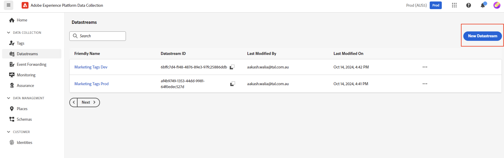

4. **Configure Datastream Settings:** Provide a descriptive name for your datastream. You can also add the description.

5. **Select Mapping Schema:** Choose the mapping schema you want to use with this specific datastream. You can create a datastream without specifying the schema as well. 

6. **Geolocation And Network Lookup:** Tick off geolocation and network information that you want to collect with your datastream.

7. **Save:** Double check the settings and click on save.

   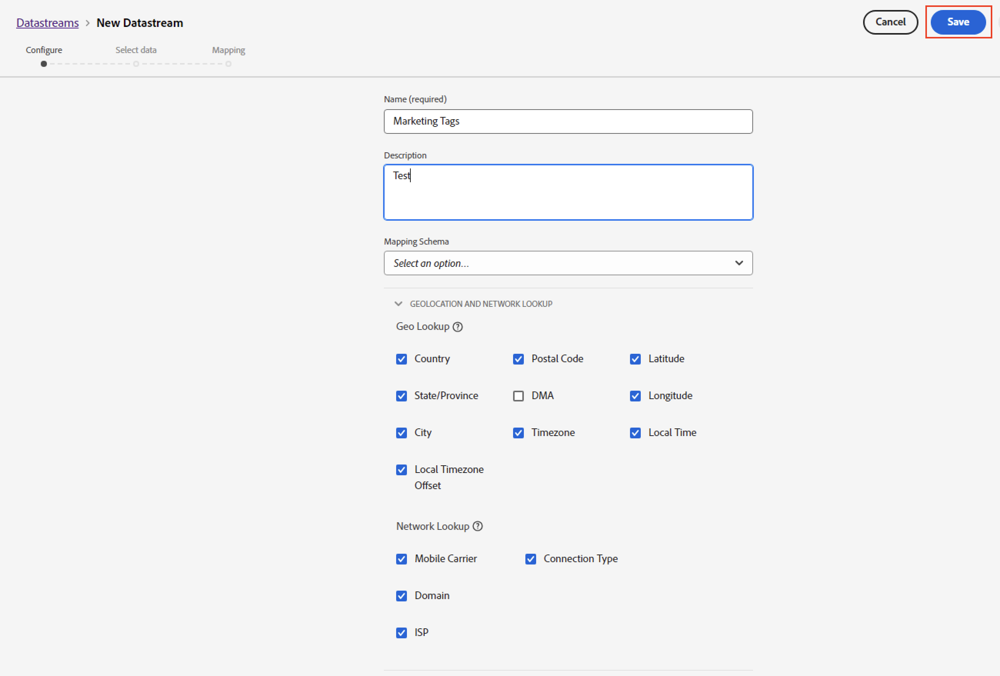
   
# Event Forwarding
Lets learn what event forwarding is before we learn how to configure a service in datastream. 

Event forwarding in Adobe Experience Platform allows you to send collected event data to a destination for server-side processing. Event forwarding decreases web page and app weight by using Adobe Experience Platform Edge Network to execute tasks normally done on the client. Implemented in a similar manner to tags, event forwarding rules can transform and send data to new destinations, but instead of sending this data from a client application like a web browser, it is sent from Adobe’s servers.

## Create Event Forwarding Property

### Steps:

1. **Select Event Forwarding:** Under event forwarding in your left hand panel, click on event forwarding.
2. **Create the property:**Click on **New Property** and give it an appropriate name and click on **Save**

   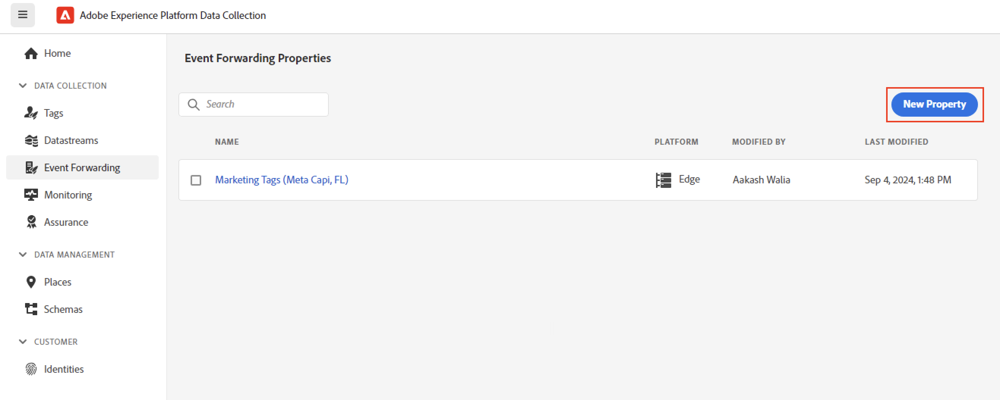

## Adding Event Forwarding Service

### Steps:

1. **Access Your Datastream:** Once you have created a datastream, locate and open it in Adobe Experience Platform.

2. **Add a Service:** Click on **Add a Service** within your datastream.

   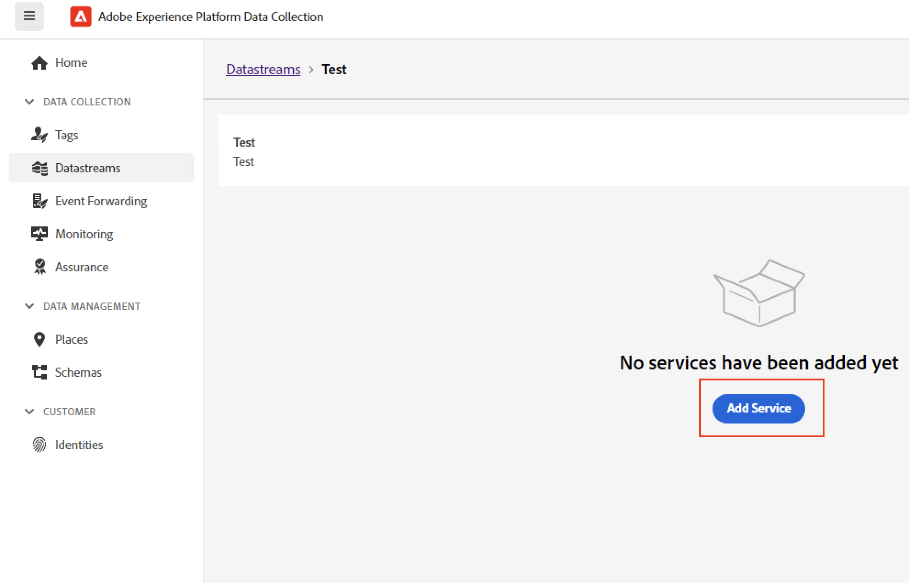

3. **Select Service Type:** From the dropdown list, select **Event Forwarding** as the service type.

   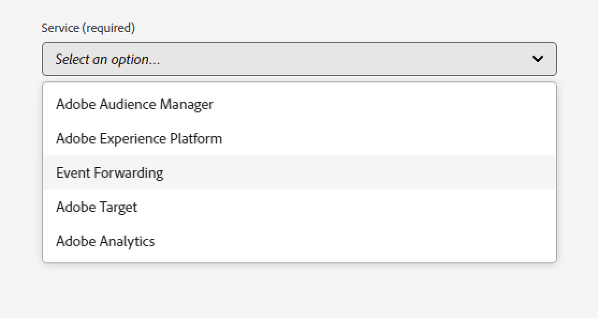

4. **Map to Event Forwarding Property:** Choose your desired event forwarding property from the dropdown list to map it accordingly.

5. **Select Environment:** Specify the environment you wish to use for this service.
  
6. **Save Configuration:** Click **Save** to finalize and apply your service configuration.

# Schema
A schema is a set of rules that represent and validate the structure and format of data. At a high level, schemas provide an abstract definition of a real-world object (such as a person) and outline what data should be included in each instance of that object (such as first name, last name, birthday, and so on). XDM schemas are ideal for storing vast amounts of complex data in a self-contained format. You can have multiple schemas configured and choose the one that fits your use case. 

   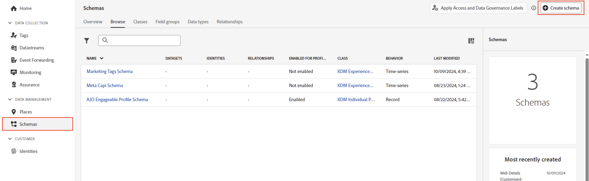

## Mapping the schema

### Steps:

1. **Create Data Schema:** Click on create schema and choose manual option. Further choose User, Event or other depending on what information you want to collect in your schema.
2. **Edit Data Schema:** Once your schema is created, you can also edit your schema using data fields. You can also choose where in schema you want your data fields. For this specific scenario, we required information like email, phone, fbc (facebook cookie) etc. These were added in different parts of the schema.

   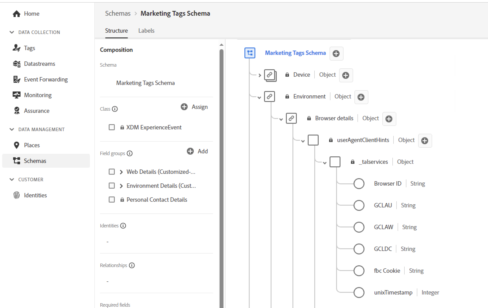
   
You are ready to start creating rules in client side and server side after you have created the datastreams, created the property, configured the service and created the schema as per your use case. 

# Client Side Setup

## Websdk Extension

Begin by configuring the WebSDK extension on the client side. This extension facilitates the transmission of necessary parameters with the payload from the Adobe Edge server to platforms such as Facebook or Campaign Manager. The only required configuration required is **IMS Organisation ID and Datastreams** Set up the IMS Organisation ID and the datastreams you have configured. You can further configure other settings such as personalisation and identity settings as required. These settings will govern the type of data collected and the method of collection.

   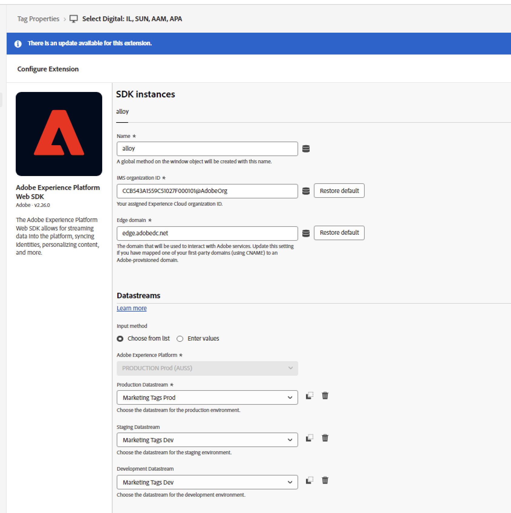

Upon completing the configuration, proceed to create global variables containing specific data within schemas intended for server-side transmission. It is essential to establish three primary rules:

1. **Global Data Object -** Define the global object or data that should accompany all server calls.

   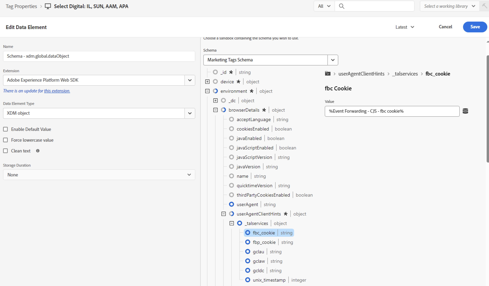
   
2. **Global Data Variable -** Establish a variable that is updated and populated with specific data. This variable can be referenced similarly to other data elements.

   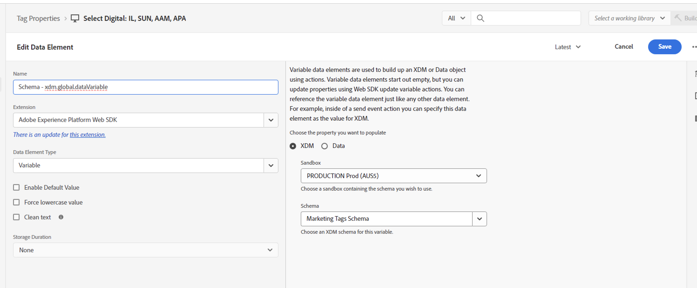
   
3. **Global Merge Object -** Implement this data element to perform dual functions: transmitting the correct information to the server and updating the variable. It merges two data elements used in tandem.

   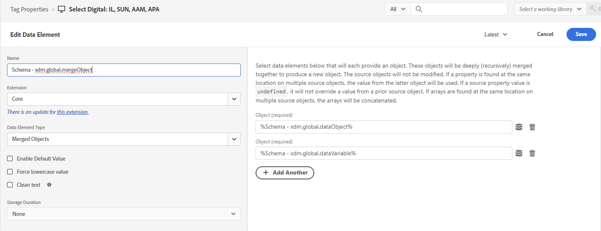

In addition to the above three data elements, you should create data elements to capture the information required necessary for your ads platform. For example - Meta CAPI requires you to send a unique event id, fpc, fbp, user agent etc. CM API requires information like hashed email, hashed phone, GCLDC cookie etc to enhance the conversions.

   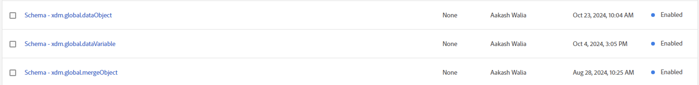
                                                     
After you have created data elements to capture the information you require, you can create the rules to send data to server side.

## Rule Configuration

Facebook Pixel is already setup, you need to add further actions to enable the pixel to send the paramters you need server side. Configure a SEND EVENT after your facebook pixel. Set the type of event (pageviews if its a pageview rule, Lead if its a lead event) and populate the XDM field with the Merge Object you created earlier. This enables the schema to be sent to adobe edge network. You can use the path for the specific variables and reference them to send it with your server side call. 

   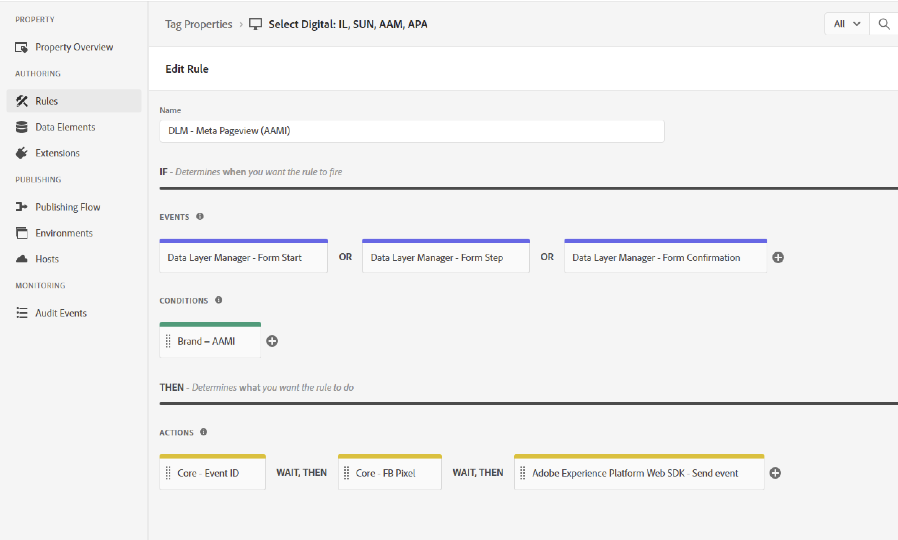

# Server Side Setup

## Extensions

For CM and Meta you need the follwing two extensions:

1. Meta Conversions API Extension - You need Pixel ID and Access Token from your meta account for specific account to establish the connection. After the connection is established you can configure the rule and send data from Adobe Edge Server to your meta platform.

   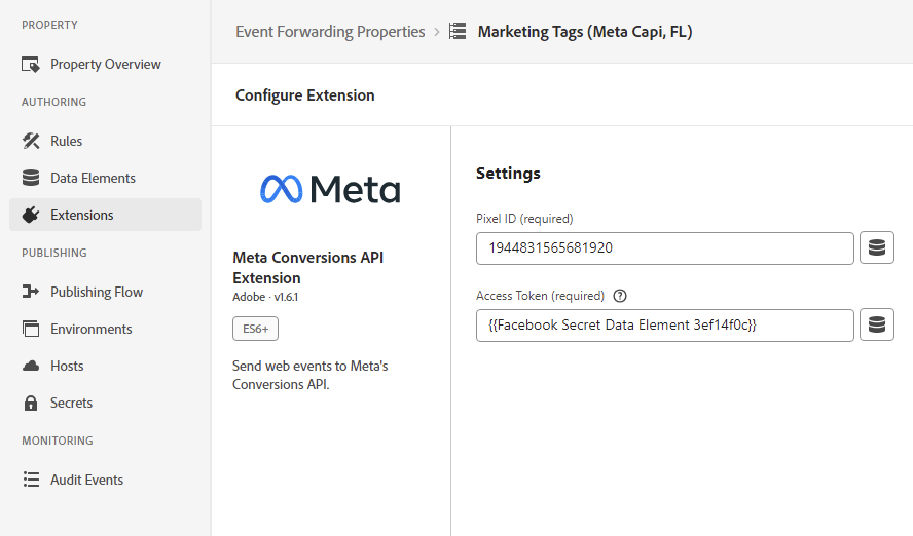

**Note** that you can only use one Pixel ID and Access Token to integrate with your Meta account. However, when you are creating the rule, you can overwrite the pixel ids and access tokens.

   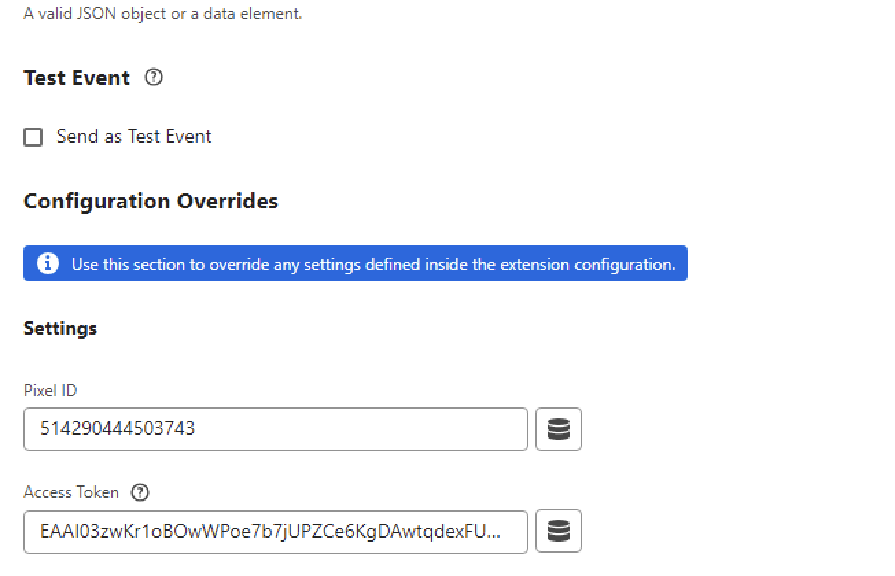
   
2. Adobe Cloud Connector - No configuration necessary.

Now you can start creating the data elements and rules server side.

## Data Elements

Data elements are inherently limited in server-side contexts due to their inability to be deployed directly on websites. Consequently, they can only reference variables transmitted to your server. This limitation is addressed through the use of schemas, which facilitate the capture of parameters on the server side that were initially collected on your website. To achieve this, reference the path of the parameter within the schema. This approach ensures that the necessary data is accurately captured and utilised for server-side operations.

   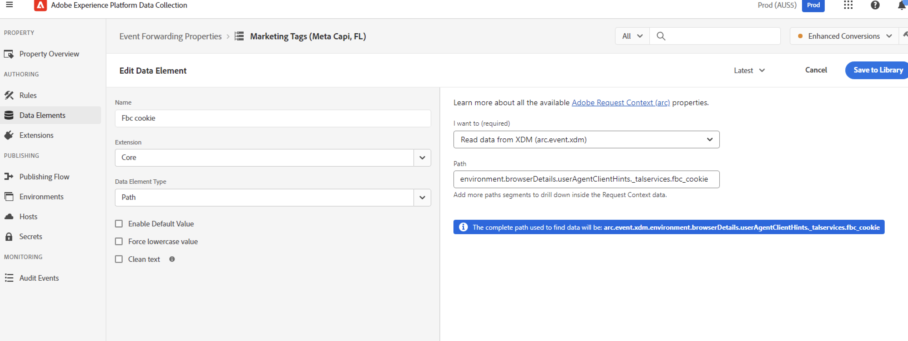
   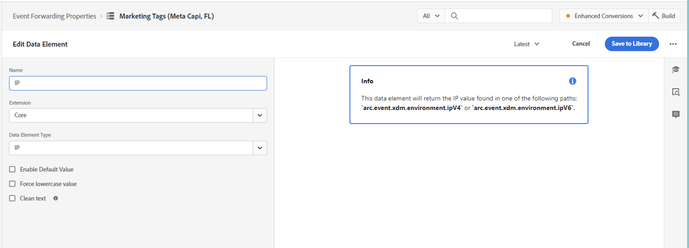
   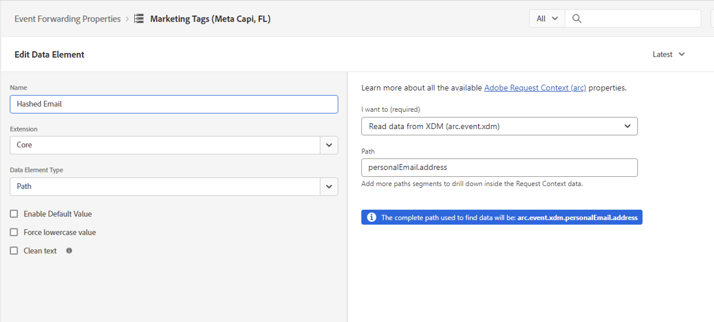

## Rule Configuration

In contrast to client-side operations, server-side processes do not utilise triggers, as it is not possible to execute a rule directly on the server. Instead, data can only be forwarded or pushed from the client (web or app) to the server. However, similar to client-side rules, server-side operations can employ conditions to determine actions based on specific pages and events. By defining these conditions, you ensure that the appropriate actions are taken when the specified criteria are satisfied, thereby facilitating effective server-side data handling.

For instance, when configuring a Lead event for an AAMI account, you may establish the following conditions to specify the desired actions when these conditions are met:

  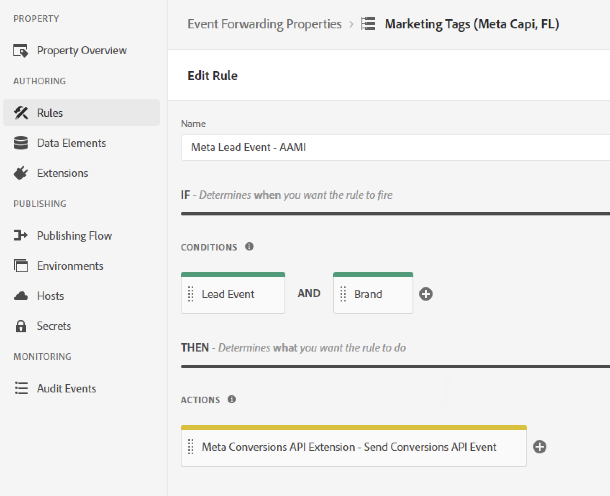

1. Conditions - Lead Event condition to configure the rule to execute exclusively when the event is identified as a lead event and Brand condition to ensure the rule fires only when the brand is AAMI, excluding other digital brands such as APIA.

  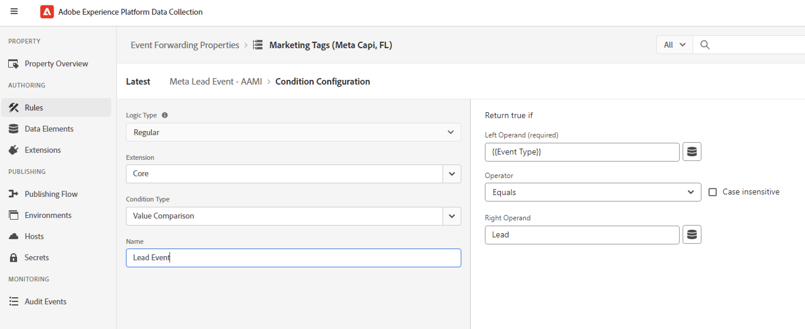
  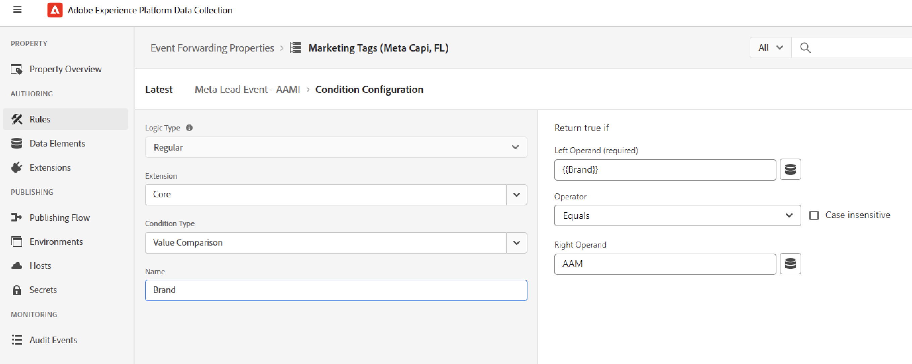

3. Actions - Set up the action to transmit the API conversion event to Meta. Populate the fields with the appropriate event parameters, such as using {{fbc cookie}} for the click ID and {{fbp cookie}} for the browser ID.

  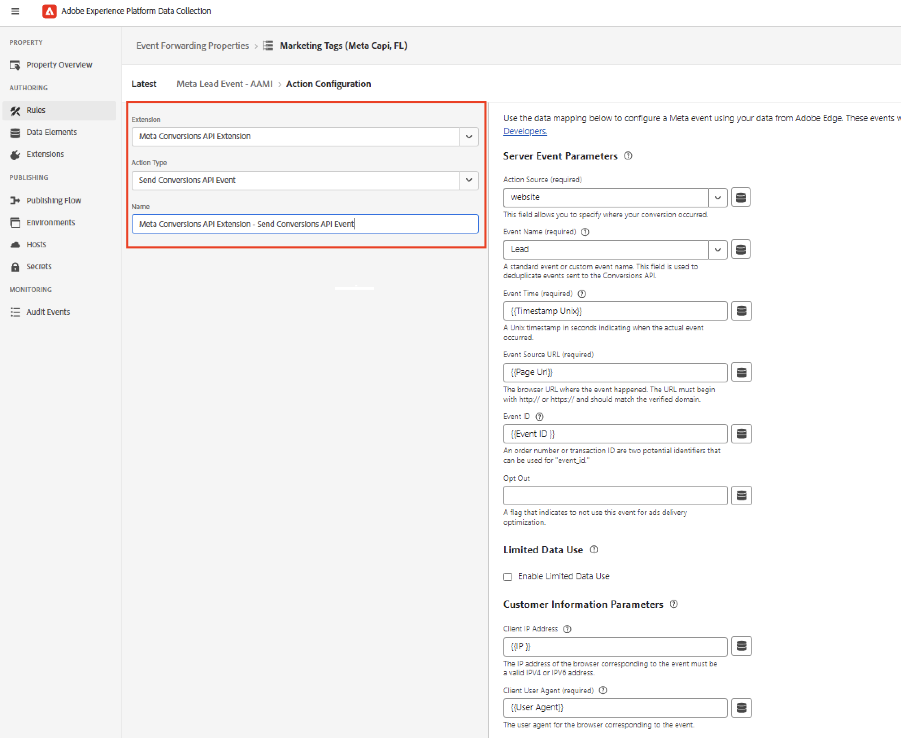

Once the rule is configured, proceed to publish it in the development environment. Utilize the Adobe Cloud Debugger extension to conduct thorough testing. Upon successful validation of the rules, you may publish them to the production environment.

By adhering to these steps, you can ensure precise execution and validation of server-side rules, enhancing data handling and integration processes.
